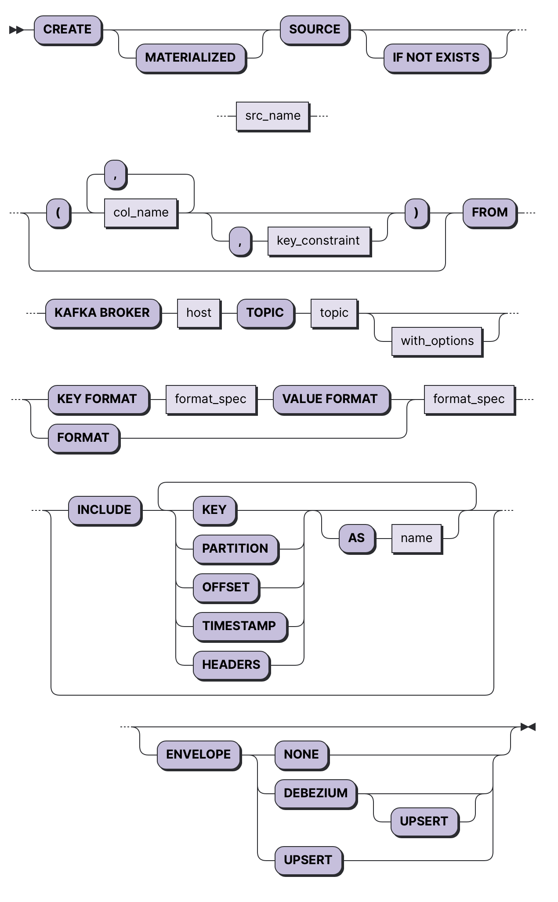
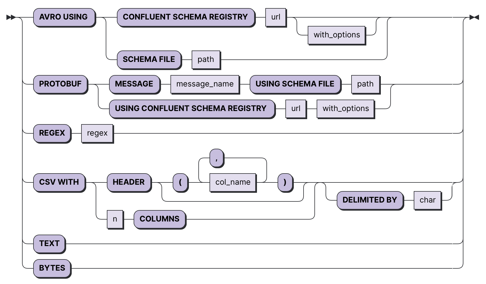
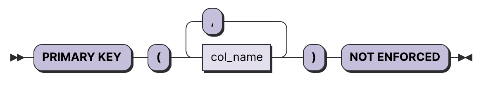
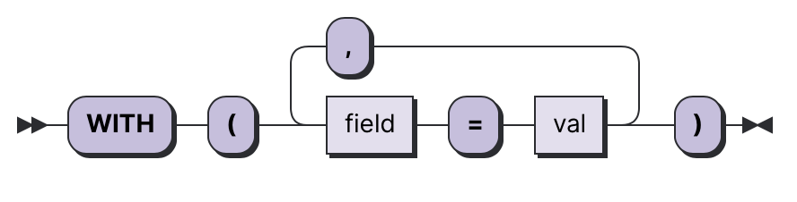

`CREATE SOURCE` connects Blazar to an external data source and lets you interact with its data as if the data were in a SQL table.

This page details how to connect Blazar to a Kafka broker to read data from individual topics.

## Conceptual framework

Sources represent connections to resources outside Blazar that it can read data from. For more information, 
see [Key Concepts: Sources](https://{@domain@}/docs/overview/key-concepts/#sources).

## Syntax



### format_spec



### key_constraint



### with_options



| Field                                           | Use                                                          |
| :---------------------------------------------- | :----------------------------------------------------------- |
| **MATERIALIZED**                                | Materializes the source’s data, which retains all data in memory and makes sources directly selectable. For more information, see [Key Concepts: Materialized sources](https://{@domain@}/docs/overview/key-concepts/#materialized-sources). |
| *src_name*                                      | The name for the source, which is used as its table name within SQL. |
| *col_name*                                      | Override default column name with the provided [identifier](https://{@domain@}/docs/sql/identifiers). If used, a *col_name* must be provided for each column in the created source. |
| **KAFKA BROKER** *host*                         | The Kafka broker’s host name without the security protocol, which is specified by the [`WITH` options](https://{@domain@}/docs/sql/create-source/kafka/#with-options).) If you wish to specify multiple brokers (bootstrap servers) as an additional safeguard, use a comma-separated list. For example: `localhost:9092, localhost:9093`. |
| **TOPIC** *topic*                               | The Kafka topic you want to subscribe to.                    |
| **INCLUDE KEY**                                 | Include a column containing the Kafka message key. If the key is encoded using a format that includes schemas the column will take its name from the schema. For unnamed formats (e.g. `TEXT`), the column will be named `key`. The column can be renamed with the optional **AS** *name* statement. |
| **INCLUDE PARTITION**                           | Include a `partition` column containing the Kafka message partition. The column can be renamed with the optional **AS** *name* clause. *New in v0.12.0.* |
| **INCLUDE OFFSET**                              | Include an `offset` column containing the Kafka message offset. The column can be renamed with the optional **AS** *name* clause. *New in v0.12.0.* |
| **INCLUDE TIMESTAMP**                           | Include a `timestamp` column containing the Kafka message timestamp. The column can be renamed with the optional **AS** *name* clause. *New in v0.12.0.*  Note that the timestamp of a Kafka message depends on how the topic and its producers are configured. See the [Confluent documentation](https://docs.confluent.io/3.0.0/streams/concepts.html?#time) for details. |
| **PRIMARY KEY (** *col_list* **) NOT ENFORCED** | Declare a set of columns as a primary key. For more information, see [`Defining primary keys`](https://{@domain@}/docs/sql/create-source/kafka/#defining-primary-keys). |
| **WITH (** *option_list* **)**                  | Options affecting source creation. For more detail, see [`WITH` options](https://{@domain@}/docs/sql/create-source/kafka/#with-options). |

## WITH options

| Field                                | Value     | Description                                                  |
| ------------------------------------ | --------- | ------------------------------------------------------------ |
| `client_id`                          | `text`    | Use the supplied value as the Kafka client identifier.       |
| `group_id_prefix`                    | `text`    | Use the specified prefix in the consumer group ID. The resulting `group.id` looks like `materialize-X-Y`, where `X` and `Y` are values that allow multiple concurrent Kafka consumers from the same topic. |
| `ignore_source_keys`                 | `boolean` | Default: `false`. If `true`, do not perform optimizations assuming uniqueness of primary keys in schemas. |
| `isolation_level`                    | `text`    | Default: `read_committed`. Controls how to read messages that were transactionally written to Kafka. Supported options are `read_committed` to read only committed messages and `read_uncommitted` to read all messages, including those that are part of an open transaction or were aborted. |
| `statistics_interval_ms`             | `int`     | `librdkafka` statistics emit interval in `ms`. A value of 0 disables statistics. Statistics can be queried using the `mz_kafka_source_statistics` system table. Accepts values [0, 86400000]. |
| `timestamp_frequency_ms`             | `int`     | Default: `1000`. Sets the timestamping frequency in `ms`. Reflects how frequently the source advances its timestamp. This measure reflects how stale data in views will be. Lower values result in more-up-to-date views but may reduce throughput. |
| `topic_metadata_refresh_interval_ms` | `int`     | Default: `300000`. Sets the frequency in `ms` at which the system checks for new partitions. Accepts values [0,3600000]. |
| `enable_auto_commit`                 | `boolean` | Default: `false`. Controls whether or not Blazar commits read offsets back into Kafka. This is purely for consumer progress monitoring and does not cause Blazar to resume reading from where it left off across restarts. |
| `fetch_message_max_bytes`            | `int`     | Default: `134217728`. Controls the initial maximum number of bytes per topic+partition to request when fetching messages from the broker. If the client encounters a message larger than this value it will gradually try to increase it until the entire message can be fetched. Accepts values [1, 1000000000]. |

## Supported formats

| Format     | Append-only envelope | Upsert envelope | Debezium envelope |
| ---------- | -------------------- | --------------- | ----------------- |
| Avro       |          ✓           |        ✓        |         ✓         |
| JSON       |          ✓           |        ✓        |                   |
| Protobuf   |          ✓           |        ✓        |                   |
| Text/bytes |          ✓           |        ✓        |                   |
| CSV        |          ✓           |                 |                   |

### Key-value encoding

By default, the message key is decoded using the same format as the message value. However, you can set the key and value encodings explicitly using the `KEY FORMAT ... VALUE FORMAT` [syntax](https://{@domain@}/docs/sql/create-source/kafka/#syntax).

## Features

### Handling upserts

To create a source that uses the standard key-value convention to support inserts, updates, and deletes within Blazar, you can use `ENVELOPE UPSERT`:

```sql
CREATE SOURCE current_predictions
  FROM KAFKA BROKER 'localhost:9092' TOPIC 'events'
  FORMAT AVRO USING CONFLUENT SCHEMA REGISTRY 'https://localhost:8081'
  ENVELOPE UPSERT;
```

Note that:

- Using this envelope is required to consume [log compacted topics](https://docs.confluent.io/platform/current/kafka/design.html#log-compaction).

### Defining primary keys

Blazar will **not enforce** the constraint and will produce wrong results if it’s not unique.

Primary keys are **automatically** inferred for Kafka sources using the `UPSERT` or `DEBEZIUM` envelopes. For other source configurations, you can manually define a column (or set of columns) as a primary key using the `PRIMARY KEY (...) NOT ENFORCED` [syntax](https://{@domain@}/docs/sql/create-source/kafka/#key_constraint). This enables optimizations and constructs that rely on a key to be present when it cannot be inferred.

### Exposing source metadata

In addition to the message value, Blazar can expose the message key, headers and other source metadata fields to SQL.

### Key

The message key is exposed via the `INCLUDE KEY` option. Composite keys are also supported ([#7645](https://github.com/MaterializeInc/materialize/issues/7645)).

```sql
CREATE SOURCE kafka_metadata
  FROM 'localhost:9092' TOPIC 'data'
  KEY FORMAT TEXT
  VALUE FORMAT TEXT
  INCLUDE KEY AS renamed_id;
```

Note that:

- This option requires specifying the key and value encodings explicitly using the `KEY FORMAT ... VALUE FORMAT` [syntax](https://{@domain@}/docs/sql/create-source/kafka/#syntax).
- The `UPSERT` envelope always includes keys.
- The `DEBEZIUM` envelope is incompatible with this option.

### Headers

Message headers are exposed via the `INCLUDE HEADERS` option, and are included as a column (named `headers` by default) containing a [`list`](https://{@domain@}/docs/sql/types/list/) of ([`text`](https://{@domain@}/docs/sql/types/text/), [`bytea`](https://{@domain@}/docs/sql/types/bytea/)) pairs.

```sql
CREATE SOURCE kafka_metadata
  FROM KAFKA BROKER 'localhost:9092' TOPIC 'data'
  FORMAT AVRO USING CONFLUENT SCHEMA REGISTRY 'https://localhost:8081'
  INCLUDE HEADERS
  ENVELOPE NONE;
```

To retrieve the headers in a message, you can unpack the value:

```sql
SELECT key,
       field1,
       field2,
       headers[1].value AS kafka_header
FROM mv_kafka_metadata;

  key  |  field1  |  field2  |  kafka_header
-------+----------+----------+----------------
  foo  |  fooval  |   1000   |     hvalue
  bar  |  barval  |   5000   |     <null>
```

, or lookup by key:

```sql
SELECT key,
       field1,
       field2,
       thekey,
       value
FROM (SELECT key,
             field1,
             field2,
             unnest(headers).key AS thekey,
             unnest(headers).value AS value
      FROM mv_kafka_metadata) AS km
WHERE thekey = 'kvalue';

  key  |  field1  |  field2  |  thekey  |  value
-------+----------+----------+----------+--------
  foo  |  fooval  |   1000   |  kvalue  |  hvalue
```

Note that:

- The `DEBEZIUM` envelope is incompatible with this option.

#### Partition, offset, timestamp

These metadata fields are exposed via the `INCLUDE PARTITION`, `INCLUDE OFFSET` and `INCLUDE TIMESTAMP` options.

```sql
CREATE SOURCE kafka_metadata
  FROM KAFKA BROKER 'localhost:9092' TOPIC 'data'
  FORMAT AVRO USING CONFLUENT SCHEMA REGISTRY 'https://localhost:8081'
  INCLUDE PARTITION, OFFSET, TIMESTAMP AS ts
  ENVELOPE NONE;
SELECT "offset" FROM kafka_metadata WHERE ts > '2021-01-01';

offset
------
15
14
13
```

Note that:

- Using the `INCLUDE OFFSET` option with Debezium requires `UPSERT` semantics.

## Setting start offsets

To start consuming a Kafka stream from a specific offset, you can use the `start_offset` option.

```sql
CREATE MATERIALIZED SOURCE kafka_offset
  FROM KAFKA BROKER 'localhost:9092' TOPIC 'data'
  -- Start reading from the earliest offset in the first partition,
  -- the second partition at 10, and the third partition at 100
  WITH (start_offset=[0,10,100])
  FORMAT AVRO USING CONFLUENT SCHEMA REGISTRY 'https://localhost:8081';
```

Note that:

- If fewer offsets than partitions are provided, the remaining partitions will start at offset 0. This is true if you provide `start_offset=1` or `start_offset=[1, ...]`.
- If more offsets than partitions are provided, then any partitions added later will incorrectly be read from that offset. So, if you have a single partition, but you provide `start_offset=[1,2]`, when you add the second partition you will miss the first 2 records of data.
- Using an offset with a source envelope that can supply updates or deletes requires that Blazar handle possibly nonsensical events (e.g. an update for a row that was never inserted). For that reason, starting at an offset requires either a `NONE` envelope or a `(DEBEZIUM) UPSERT` envelope.

### Time-based offsets

It’s also possible to set a start offset based on Kafka timestamps, using the `kafka_time_offset` option. This approach sets the start offset for each available partition based on the Kafka timestamp and the source behaves as if `start_offset` was provided directly.

It’s important to note that `kafka_time_offset` is a property of the source: it will be calculated *once* at the time the `CREATE SOURCE` statement is issued. This means that the computed start offsets will be the **same** for all views depending on the source and **stable** across restarts.

If you need to limit the amount of data maintained as state after source creation, consider using [temporal filters](https://{@domain@}/docs/sql/patterns/temporal-filters/) instead.

### `WITH` options

| Field               | Value | Description                                                  |
| :------------------ | :---- | :----------------------------------------------------------- |
| `start_offset`      | `int` | Read partitions from the specified offset. You cannot update the offsets once a source has been created; you will need to recreate the source. Offset values must be zero or positive integers, and the source must use either `ENVELOPE NONE` or `(DEBEZIUM) UPSERT`. |
| `kafka_time_offset` | `int` | Use the specified value to set `start_offset` based on the Kafka timestamp. Negative values will be interpreted as relative to the current system time in milliseconds (e.g. `-1000` means 1000 ms ago). The offset for each partition will be the earliest offset whose timestamp is greater than or equal to the given timestamp in the corresponding partition. If no such offset exists for a partition, the partition’s end offset will be used. |

## Examples

### Creating a source

import Tabs from "@theme/Tabs"
import TabItem from "@theme/TabItem"

<Tabs defaultValue="csv" values={[
  { label: "CSV", value: "csv" },
  { label: "Avro", value: "avro" },
  { label: "Protobuf", value: "protobuf" },
  { label: "Text/bytes", value: "text_bytes" },
]}>
<TabItem value="csv">


```blazar-sql
CREATE SOURCE csv_source (col_foo, col_bar, col_baz)
  FROM KAFKA BROKER 'localhost:9092' TOPIC 'data'
  FORMAT CSV WITH 3 COLUMNS;
```

</TabItem>
<TabItem value="avro">

:::info
Under development, stay tuned!
:::

</TabItem>
<TabItem value="protobuf">

:::info
Under development, stay tuned!
:::

</TabItem>
<TabItem value="text_bytes">

:::info
Under development, stay tuned!
:::

</TabItem>
</Tabs>